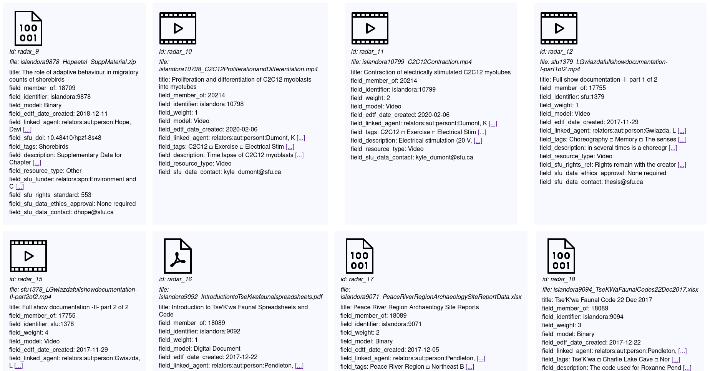

During `--check`, you can generate a contact sheet from your input CSV by adding the command-line option `--contactsheet`, like this:

* `./workbench --config anyconfig.yml --check --contactsheet`

If you use this option, Workbench will tell you the location of your contact sheet, e.g. `Contact sheet is at /home/mark/hacking/islandora_workbench/contact_sheet_output/contact_sheet.htm`, which you can then open in your web browser.

Contact sheets looks like this:

The icons (courtesy of [icons8](https://icons8.com/)) indicate if the item in the CSV is an:

* image
* PDF
* video
* audio
* miscellaneous binary file
* compound item

An additional icon that indicates that there is no file in the input CSV for the item.

Fields with long values are indicated by "[...]". Placing your pointer over this will show a popup that contains the full value. Also, in fields that have multiple values, the subdelimiter defined in your configuration file is replaced by a small square (&square;), to improve readability.

If there are any compound items in your CSV, they are indicated by a "compound" icon and a link to a separate contact sheet containing all their members:

The members contact sheet looks like this:

You can define where your contact sheet is written to using the `contact_sheet_output_dir` configuration setting. All the HTML, CSS, and image files that are part of the contact sheet(s) is written to this directory, so if you want to share it with someone (for quality assurance purposes, for example), you can give them a copy of the directory.

