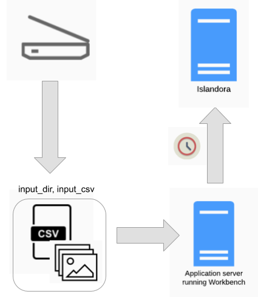
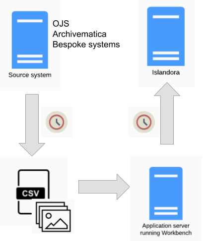

Islandora Workbench can be used in a variety of content ingest workflows. Several are outlined below.

## Batch ingest

This is the most common workflow. A user prepares a CSV file and accompanying media files, and runs Workbench to ingest the content:


Note that within this basic workflow, options exist for creating nodes with [no media](/islandora_workbench_docs/nodes_only/), and creating stub nodes [from files](/islandora_workbench_docs/creating_nodes_from_files/) (i.e., no accompanying CSV file).

## Distributed batch ingest

It is possible to separate the tasks of creating a node and its accompanying media. This can be done in a couple of ways:

* creating the nodes first, using the `nodes_only: true` configuration option, and [adding media to those nodes](/islandora_workbench_docs/adding_media/) separately
* creating stub nodes [directly from media files](/islandora_workbench_docs/creating_nodes_from_files/), and [updating the nodes](/islandora_workbench_docs/updating_nodes/) separately


In this workflow, the person creating the nodes and the person updating them later need not be the same. In both cases, Workbench can create an [output CSV](/islandora_workbench_docs/output_csv/) that can be used in the second half of the workflow.

## Migrations

Islandora Workbench is not intended to replace Drupal's Migrate framework, but it can be used in conjunction with other tools and processes as part of an "[extract, transform, load](https://en.wikipedia.org/wiki/Extract,_transform,_load)" (ETL) workflow. The source could be any platform. If it is Islandora 7, several tools exist to extract content, including the [get_islandora_7_content.py](/islandora_workbench_docs/exporting_islandora_7_content/) script that comes with Workbench or the [Islandora Get CSV](https://github.com/mjordan/islandora_get_csv) module for Islandora 7. This content can then be used as input for Islandora Workbench, as illustrated here:


On the left side of the diagram, `get_islandora_7_content.py` or the Islandora Get CSV module are used in the "extract" phase of the ETL workflow, and on the right side, running the user's computer, Islandora Workbench is used in the "load" phase. Before loading the content, the user would modify the extracted CSV file to confirm with Workbench's CSV content requirements.

The advantage of migrating to Islandora in this way is that the exported CSV file can be cleaned or supplemented (manually or otherwise) prior to using it as Workbench's input. The specific tasks required during this "transform" phase will vary depending on the quality and consistency of metadata and other factors.

!!! note
    Workbench's ability to add multiple media to a node at one time is useful during migrations, if you want to reuse derivatives such as thumbnails and OCR transcripts from the source platform. Using this ability can speed up ingest substantially, since Islandora won't need to generate derivative media that are added this way . See the "[Adding multiple media](/islandora_workbench_docs/adding_multiple_media)" section for more information.

## Watch folders

Since Islandora workbench is a command-line tool, it can be run in a scheduled job such as Linux "cron". If CSV and file content are present when Workbench runs, Workbench will operate on them in the same way as if a person ran Workbench manually. In the diagram below, the source of the files is the daily output of someone scanning images. If these images are saved in the directory that is specified in Workbench's `input_dir` configuration option, and Workbench is run in a cron job using the "[create_from_files](/islandora_workbench_docs/creating_nodes_from_files/)" task, nodes will be created when the cron job executes (over night, for example):



A variation on this workflow is to combine it with the "Distributed" workflow described above:


In this workflow, the nodes are created overnight and then updated with CSV data the next day.

!!! note
    Islandora Workbench does not detect changes in directories. While tools to do so exist, Workbench's ability to ingest Islandora content in batches makes it useful to scheduled jobs, as opposed to realtime detection of new files in a directory.

## Integrations with other systems

A combination of the "Migrations" workflow and the "Watch folder" workflow can be used to automate the periodic movement of content from a source system (in the diagram below, Open Journal Systems or Archivematica) into Islandora:



The extraction of data from the source system, conversion of it into the CSV and file arrangement Workbench expects, and running of Workbench can all be scripted and executed in sequence using scheduled jobs.

### Using hooks

Islandora Workbench enables you to execute scripts immediately after a node is created or updated, or a media is created, via a "post-action script" [hook](/islandora_workbench_docs/hooks/). Drupal informs Workbench if an action was successful or not, and in either case, post-action hook scripts registered in the Workbench configuration file execute. These scripts can interact with external applications:


Potential uses for this ability include adding new Islandora content to external processing queues, or informing upstream applications like those described in the "Integrations with other systems" section above that content they provide has been (or has not been) ingested into Islandora. As a simpler example, post-action hook scripts can be used to write custom or special-purpose log files.

### Sharing the input CSV with other applications

Some workflows can benefit from having Workbench share its input CSV with other scripts or applications. For example, you might use Workbench to ingest nodes into Islandora but want to use the same CSV file in a script to create metadata for loading into another application such as a library discovery layer.

Islandora Workbench strictly validates the columns in the input CSV to ensure that they match Drupal field names. To accommodate CSV columns that do not correspond to Drupal field names, you can tell Workbench to ignore specific columns that are present in the CSV. To do this, list the non-Workbench column headers in the `ignore_csv_columns` configuration setting. For example, if you want to include a `date_generated` column in your CSV, include the following in your Workbench configuration file:

```
ignore_csv_columns: ['date_generated']
```

With this setting in place, Workbench will ignore the `date_generated` column in the input CSV.

